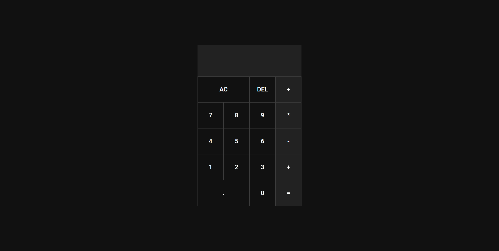

# calculadora
Project developed is a simple calculator with simple functions (addition, subtraction, etc.)

## 🚀 Technologies
This project was developed with the following technologies:
- HTML
- CSS
- JavaScript

## 📚 Libraries
- [JavaScript](https://developer.mozilla.org/pt-BR/docs/Web/JavaScript)
- [Font Awesome](https://fontawesome.com/)

## 💻 Project

[Click here to access project](https://calculadora-chi-ashen.vercel.app/)
> **Objective:** Create a Calculator.
